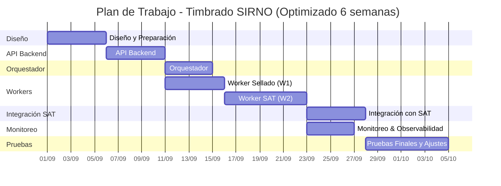

# 📝 Plan de Trabajo para Implementación del Servicio de Timbrado

## 1. Diseño y Preparación

- [ ] Definir modelo de **base de datos** (jobs, artefactos, eventos, errores).
- [ ] Diseñar esquema de **eventos**:
  - `PaqueteRecibido`
  - `PaqueteSellado`
  - `EnviadoSAT`
  - `Resultado`
- [ ] Configurar **cola de mensajería** (RabbitMQ/Kafka).
- [ ] Establecer lineamientos de **seguridad**:
  - Manejo de certificados CSD/FIEL
  - Cifrado en reposo y en tránsito

---

## 2. API Backend

- [ ] **Endpoint `POST /timbrar`**
  - Valida entrada y genera `jobId`.
  - Persiste solicitud en estado `RECEIVED`.
  - Publica evento `PaqueteRecibido`.
  - Responde `202 Accepted` con `jobId`.
- [ ] **Endpoint `GET /estatus/{jobId}`**
  - Consulta estado en DB.
  - Devuelve estado + CFDIs/errores (si existen).
- [ ] Webhooks (opcional) para notificación proactiva al cliente.

---

## 3. Orquestador

- [ ] Escucha eventos y coordina flujos.
- [ ] Publicación a colas de acuerdo al estado del job.
- [ ] Reintentos en caso de fallas de publicación.
- [ ] Integración opcional con webhook del cliente.

---

## 4. Worker Sellado (W1)

- [ ] Consumir `PaqueteRecibido`.
- [ ] Leer configuración y certificados desde DB.
- [ ] Validar, armar y sellar XML.
- [ ] Persistir artefactos en DB con estado `SEALED`.
- [ ] Publicar evento `PaqueteSellado`.

---

## 5. Worker SAT (W2)

- [ ] Consumir `PaqueteSellado`.
- [ ] Enviar paquete al SAT.
- [ ] Guardar ticket, actualizar estado `SUBMITTED`.
- [ ] Publicar evento `EnviadoSAT`.
- [ ] Implementar **polling/callback** para obtener resultado final.
- [ ] Actualizar estado a `TIMBRADO` o `ERROR`.
- [ ] Persistir CFDIs/errores.
- [ ] Publicar evento `Resultado`.

---

## 6. Integración con SAT

- [ ] Configurar conexión a **ambiente de pruebas SAT**.
- [ ] Validar autenticación con CSD/FIEL.
- [ ] Probar escenarios de error/rechazo.
- [ ] Ajustar tiempos de espera y políticas de reintento.

---

## 7. Monitoreo y Observabilidad

- [ ] Integrar logs estructurados en API, Workers y Orquestador.
- [ ] Exponer métricas (jobs recibidos, terminados, fallidos).
- [ ] Crear dashboard de monitoreo (Grafana/Prometheus).

---

## 8. Pruebas

- [ ] Unitarias (API, workers).
- [ ] Integración con colas y DB.
- [ ] End-to-end con SAT en ambiente de certificación.
- [ ] Stress test con alto volumen de timbrado.
- [ ] Ajustes y hardening de seguridad.

---

## 📅 Cronograma Optimizado (6 semanas, inicio 1 de septiembre 2025)

