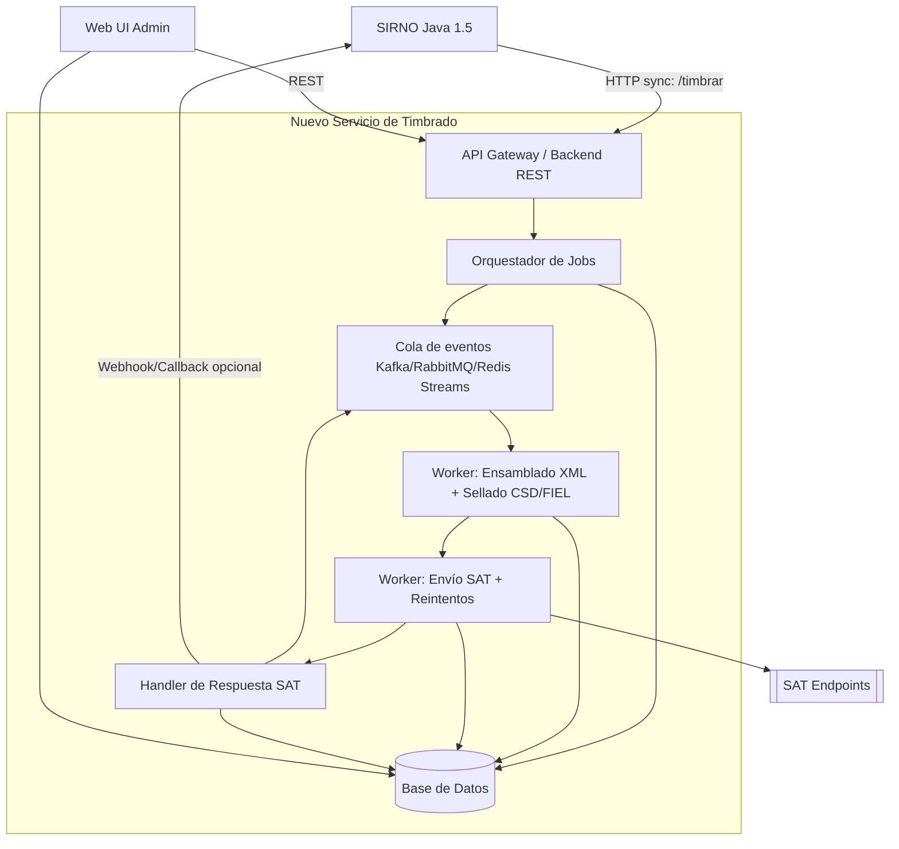
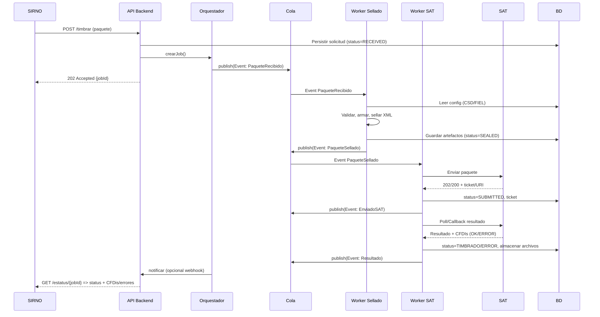

# Arquitectura híbrida propuesta

Objetivo: Mantener a **SIRNO (Java 1.5)** consumiendo un endpoint síncrono, mientras el **nuevo servicio de timbrado** procesa de forma asíncrona mediante eventos/colas, persistencia en BD y administración vía **Web UI**.

---

## 1) Vista de componentes

---

## 2) Diagrama de secuencia

---

## 3) Modelo de datos (mínimo viable)

- **tenants** _(opcional si multi-razón social)_: id, nombre, rfc, activo
- **certificates**: id, tenant_id, tipo(CSD/FIEL), numero_serie, vence_en, archivo(.cer/.key/.pfx), pass_encrypted, estado
- **sat_config**: id, tenant_id, ambiente(test/prod), endpoints, timeouts, retiros, tls_min
- **jobs**: id, tenant_id, referencia_externa, status( RECEIVED|SEALED|SUBMITTED|TIMBRADO|ERROR ), created_at
- **job_events**: id, job_id, tipo, payload_json, created_at
- **artifacts**: id, job_id, tipo(XML_ORIGEN|XML_SELLADO|CFDI|ZIP|EVIDENCIA), storage_uri, hash
- **users**: id, email, role(ADMIN|OPERADOR|LECTOR), password_hash, two_factor_secret
- **audit_logs**: id, actor_id, accion, objeto, diff_json, ip, created_at

---

## 4) Endpoints para SIRNO (compatibilidad)

- `POST /api/timbrado/nomina` → **202 Accepted** `{ jobId }`
- `GET /api/timbrado/estatus/{jobId}` → `{ status, errores?, uuid?, descargas? }`
- **Opcional**: `POST /api/timbrado/callback` (si SIRNO soporta webhook)

> Mantener los formatos actuales de entrada/salida para no tocar SIRNO.

## 5) Web UI (módulos)

- **Dashboard**: colas, jobs por estado, tiempos promedio, errores recientes
- **Timbrados**: búsqueda por RFC, periodo, folio, jobId; descarga de CFDIs/ZIP
- **Certificados**: alta/renovación CSD & FIEL, validaciones, alertas por vencimiento
- **Configuración SAT**: URLs, ambiente, timeouts, política de reintentos, TLS
- **Usuarios y Roles**: RBAC, 2FA, auditoría de cambios
- **Alertas**: notificaciones por error/cola detenida (email/webhook)

---

## 6) Reintentos y resiliencia

- Política exponencial: 1m, 5m, 15m, 1h, 6h (máx N intentos)
- Idempotencia por `jobId` y `ticket SAT`
- Circuit breaker hacia SAT; DLQ (cola de mensajes muertos)

---

## 8) Despliegue y seguridad

- Contenedores: API, Workers, Cola, DB
- Secrets: certificados y contraseñas en Object Storage OCI
- Backups BD + almacenamiento de artefactos (Object Storage OCI) con versionado
- Observabilidad: logs estructurados, métricas, trazas distribuidas

---

## 9) Roadmap de implementación

- **Fase 0**: Levantamiento + contrato de interfaz con SIRNO
- **Fase 1**: Backend REST + persistencia jobs
- **Fase 2**: Cola + Workers
- **Fase 3**: Seguridad
- **Fase 4**: Pruebas con SAT (sandbox) + pruebas carga
- **Fase 5**: Migración gradual
- **Fase 6**: Web UI (certificados, config, dashboard)

---

## 10) Matriz de decisiones

- **Arquitectura**: Híbrida (sync para SIRNO / eventos internos)
- **Cola**: RabbitMQ, Redis Streams Kafka
- **BD**: PostgreSQL o MySQL
- **Stack**: NodeJs, NestJs o Spring Boot

---

## 11) Beneficios clave

- No se toca SIRNO (Java 1.5)
- Escala por eventos y workers
- Observabilidad y auditoría completas
- Configuración centralizada por Web UI
- Resiliencia frente a caídas del SAT
