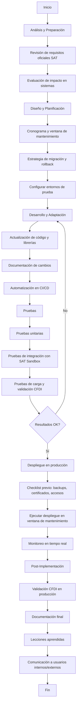

# Flujo de Planeación – Actualización SAT

```mermaid
flowchart TD

A[Inicio] --> B[Análisis y Preparación]
B --> C[Revisión de requisitos oficiales SAT]
C --> D[Evaluación de impacto en sistemas]

D --> F[Diseño y Planificación]
F --> G[Cronograma y ventana de mantenimiento]
G --> H[Estrategia de migración y rollback]
H --> I[Configurar entornos de prueba]

I --> J[Desarrollo y Adaptación]
J --> K[Actualización de código y librerías]
K --> L[Documentación de cambios]
L --> M[Automatización en CI/CD]

M --> N[Pruebas]
N --> N1[Pruebas unitarias]
N1 --> N2[Pruebas de integración con SAT Sandbox]
N2 --> N3[Pruebas de carga y validación CFDI]

N3 --> O{Resultados OK?}
O -- No --> J
O -- Sí --> P[Despliegue en producción]

P --> Q[Checklist previo: backups, certificados, accesos]
Q --> R[Ejecutar despliegue en ventana de mantenimiento]
R --> S[Monitoreo en tiempo real]

S --> T[Post-Implementación]
T --> T1[Validación CFDI en producción]
T1 --> T2[Documentación final]
T2 --> T3[Lecciones aprendidas]

T3 --> U[Comunicación a usuarios internos/externos]
U --> V[Fin]
```
